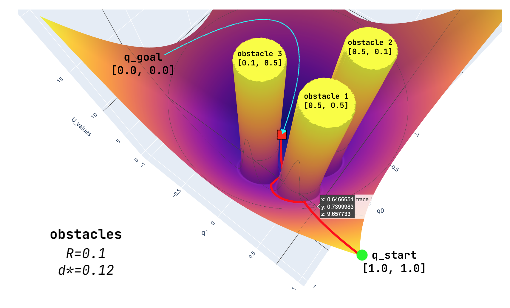

# salve

*exploring safety techniques with stable diffusion*

1. Application of a robotics inspired potential-based "obstacle avoidance" to SD prompt-to-prompt sequence generation, implemented in [JAX](https://jax.readthedocs.io/en/latest/index.html).
2. Negative prompting.

Documentation is laid out *Nature*-style for maximal credibility 😉.

- [salve](#salve)
  - [Background \& Motivating Research Questions](#background--motivating-research-questions)
  - [Results](#results)
  - [Conclusion](#conclusion)
  - [Methodology](#methodology)
    - [Applying a "Black Box" Obstacle Avoidance Potential-based "Safety" Filter to SD](#applying-a-black-box-obstacle-avoidance-potential-based-safety-filter-to-sd)
    - [Negative Prompting](#negative-prompting)
  - [Implementation](#implementation)
    - [Potential-based safety filter](#potential-based-safety-filter)
    - [Negative Prompting](#negative-prompting-1)

## Background & Motivating Research Questions

[AI safety research using Formal Methods](https://cacm.acm.org/magazines/2022/7/262079-toward-verified-artificial-intelligence/fulltext) (e.g. verification, synthesis) require abstracted, symbolic representations for formal reasoning. Language models seem promising in providing a bridge between human language and the sort of abstractions required in formal methodologies, but many questions remain unanswered about the suitability of learned representations for formal reasoning.

- How amenable are human concepts expressed in natural language and embedded by an ML model to formal methods?
- How does the diffusion model respond to manipulation of its conditioning encodings, particularly the semantic quality of outputs?
- Can we reliably intervene when the model is prompted to produce undesirable output? Can this intervention be done in a black box fashion?

I am also interested in how formal methodologies could be applied to the more general AI alignment problem, the prospect for which is [contentious](https://forum.effectivealtruism.org/posts/4rMxiyPTPdzaFMyGm/high-impact-careers-in-formal-verification-artificial).

## Results

See:
[`black_box_SD_safety_comparison.ipynb`](https://github.com/nicholasRenninger/salve/blob/main/black_box_SD_safety_comparison.ipynb)

Results are somewhat "cherry-picked" and limited in the sense that diffusion-based image generation is tricky to get right in the first place. I am by no means a prompting expert and tuning parameters to get even reasonable starting images was tricky. The two compared methods are not quite equivalent, but could be used to similar effects.

### Potential-based Safety Filtering

Here, the user's **start prompt to SD**: `white fluffy cat laying on the floor`, and wants to see an `img2img` interpolation to the **goal prompt**: `blue striped cat sitting in a box`. The API/model developer in the background has implemented a "safety" filter with the following "negative" prompts:
- `blue striped animal sitting on the ground`
- `cute tabby cat on the ground`

As humans, we would expect that the goal image output should be a cat, which is not blue or striped, sitting in some sort of box. As can be seen in the image interpolation output, this is approximately what we get. This method is brittle and unstable, but can work well. We see we can compose many different, general safety filters together and still get cogent output.

### Negative Prompting

Here we do direct negative prompting directly on the **goal prompt's image** with a simple negative prompt of: `blue stripes, blue`. We get more or less what we were looking for, hooray! The quality of the result is a bit more poor than that of the potential-based filter, but that is likely variable and largely a result of (+/-) prompt engineering.

## Conclusion

The potential-based safety filter did work but required significant tuning to work. The most important technical challenge to overcome here is useful distance metrics in the text embedding space such that the potential's gradient is well-defined. I can see many avenues for improving this, and perhaps methods for improving the embedding quality could yield better results for this method.

Comparing gradient-based saftey filtering to the use of negative prompts:

**Pros**

- works in a black-box fashion: any model can have this filtering implemented as it works with arbitrary embeddings and does not require white-box access to the model.
- produces a smooth prompt->promt sequence that avoids certain prompts 

## Methodology

**Motivated** by the relevant Formal Methodologies and inspired by prior published results on prompt->prompt interpolation, I decided to implement and compare two very different methodologies:

1. Application of a robotics inspired potential-based "obstacle avoidance" to SD prompt-to-prompt sequence generation.
2. Negative prompting.

that can be used for adding a "safety" filter.

### Applying a "Black Box" Obstacle Avoidance Potential-based "Safety" Filter to SD

Here, we'll be doing some early exploration of how prompt embeddings can be steered using [potential-based planning techniques from robotics](https://www.cs.cmu.edu/~motionplanning/lecture/Chap4-Potential-Field_howie.pdf). Potential based methods are an older motion planning technique that allow one to find paths through spaces that don't collide with obstacles. This is done by creating differentiable potential fields around the goal and obstacle coordinates which allow simple gradient descent to find a collision-free path through the space to the goal. An visualizable example of this in 2D:

is demonstrated in `black_box_SD_safety_toy_example.ipynb`.

**The potential-based safety filter produces a sequence of prompt embeddings that rapidly, smoothly change from one prompt to another while avoiding definable regions of the embedding space, as specified by a collection of "obstacle" prompts. This could be useful in an animation context or in a black-box safety filtering context.**

These methods extend to much higher dimensions and have been greatly extended in recent advances in safety-critical control, such as [control barrier functions](https://coogan.ece.gatech.edu/papers/pdf/amesecc19.pdf). I wasn't sure if the embeddings would be high-quality enough, nor a distance metric semantically well-founded enough, for this sort of technique to even apply.

### Negative Prompting

[Negative prompts](https://stable-diffusion-art.com/how-negative-prompt-work/) are a popular method to improve the alignment of diffusion model output that work by modifying the "unconditional" latents used in the diffusion process. The "unconditional" context is built from encoded "negative" text rather than the normal "unconditioned" context, which is fixed to be something like an encoded empty prompt.

When combined with an `unconditional_guidance_scale` > 1, the negative latents are removed at each diffusion step.

As my version of SD did not come with negative prompting, I made a very basic implementation of it for comparison purposes.

## Implementation

The two methodologies were developed in two separate modules:

- **`salve`**: contains the generic potential-based planning JAX utilites to build a potential function for your encodings and then run gradient descent to plan a safe path.
- **`modded_stable_diffusion`**: I did a very simple modification of `StableDiffusion.generate_image()` (L: 103-114) to a rudimentary negative prompt by simply allowing a user to pass `encoded_negative_text` as the `unconditional_context` instead of via `_get_unconditional_context()`.

### Potential-based safety filter

*The inspiration to do this came from the [`img2img` interpolation keras-cv example](https://keras.io/examples/generative/random_walks_with_stable_diffusion/)*

Getting the potential-based safety filter to work at all requires tuning many things, most importantly:

- the potential function generation parameters as specified in `salve.UConfig`. In particular, the method didn't work until I implemented cosine distance and experimented with obstacle radii and potential strength.
- using prompts with safety specification in the same encoding positions. I did not find a distance metric that would allow specifying a goal as `"blue stripy cat in a box"` and obstacle as `"blue stripes"`, instead needing to specify the obstacle as `"blue stripy animal on the ground"`.
- Using a "full" prompt encoding, e.g. the way engineered prompts include almost all 77 encodings, made some distance metrics perform better than others.
- gradient descent parameters like noise, step size and number of iterations all need to be set based on the distance metric and general obstacle types.

### Negative Prompting

Neagtive prompting, due to its very limited implementation, required little tuning. This however, meant that most of the "tuning" you do is by randomly trying different negative prompts and hoping they work. Obviously, setting the `unconditional_guidance_scale` will affect the impact of the negative prompt as well as the original prompt, but the exact response is not formalized at this time.

There are certainly better implementations of negative prompting that allow for more customizability of its behavior.
